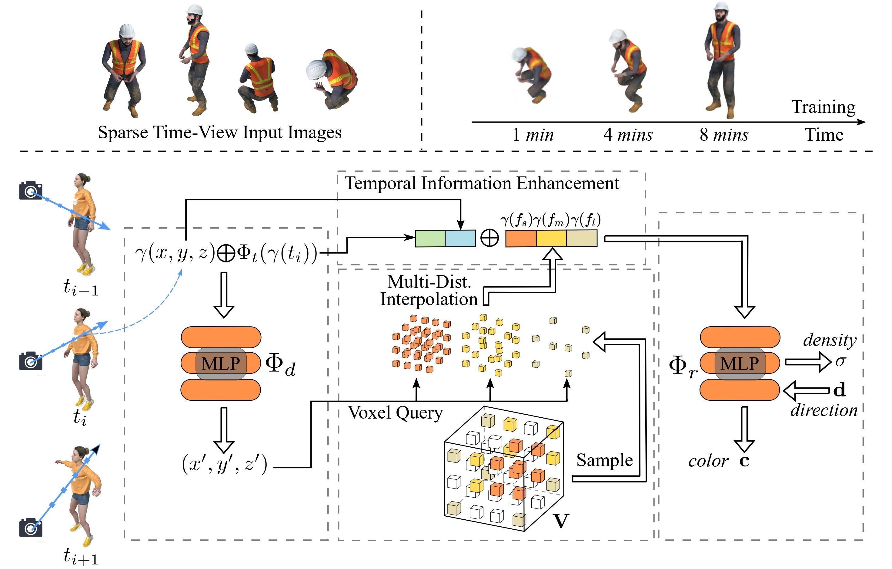

### This is the code implementation of [https://arxiv.org/abs/2205.15285](https://arxiv.org/abs/2205.15285)   

---------------------------------------------------
   
Our method converges very quickly. This is a comparison between D-NeRF (left) and our method (right). 


We propose a radiance field framework by representing scenes with time-aware voxel features. A tiny coordinate deformation network is introduced to model coarse motion trajectories and temporal information is further enhanced in the radiance network. A multi-distance interpolation method is proposed and applied on voxel features to model both small and large motions. Our framework significantly accelerates the optimization of dynamic radiance fields while maintaining high rendering quality. Empirical evaluation is performed on both syntheticand real scenes. Our method completes training with only **8 minutes** and **8-MB** storage cost while showing similar or even better rendering performance than previous dynamic NeRF methods.

## Notes
* *May. 31, 2022* The first and preliminary version is realeased. Code may not be cleaned thoroughly, so feel free to open an issue if any question.


## Requirements
* lpips
* mmcv
* imageio
* imageio-ffmpeg
* opencv-python
* pytorch_msssim
* torch
* torch_scatter

## Data Preparation
**For synthetic scenes:**  
The dataset provided in [D-NeRF](https://github.com/albertpumarola/D-NeRF) is used. You can download the dataset from [dropbox](https://www.dropbox.com/s/0bf6fl0ye2vz3vr/data.zip?dl=0). Then organize your dataset as follows.
```
├── data_dnerf 
│   ├── mutant
│   ├── standup 
│   ├── ...
```

**For real dynamic scenes:**  
The dataset provided in [HyperNeRF](https://github.com/google/hypernerf) is used. You can download scenes from [Hypernerf Dataset](https://github.com/google/hypernerf/releases/tag/v0.1) and organize them as [Nerfies](https://github.com/google/nerfies#datasets).


## Training
For training synthetic scenes such as `standup`, run 
``` 
python run.py --config configs/nerf-*/standup.py 
``` 
Use `small` for TiNeuVox-S and `base` for TiNeuVox-B.
Use `--render_video` to render a video.

For training real scenes such as `vrig_chicken`, run 
``` 
python run.py --config configs/vrig_dataset/chicken.py  
``` 

## Evaluation
Run the following script to evaluate the model.  

**For synthetic ones:**  
```
python run.py --config configs/nerf-small/standup.py --render_test --render_only --eval_psnr --eval_lpips_vgg --eval_ssim 
```

**For real ones:**  
```
python run.py --config configs/vrig_dataset/chicken.py --render_test --render_only --eval_psnr
```

To fairly compare with values reported in D-NeRF, `metric.py` is provided to directly evaluate the rendered images with `uint8` values.

## Main Results   
Please visit our [video](https://youtu.be/sROLfK_VkCk) for more rendered videos.

### Synthetic Scenes

| **Method** | **w/Time Enc.**  | **w/Explicit Rep.** |**Time** | **Storage** | **PSNR** | **SSIM** | **LPIPS** |
|:-:|:-:|:-:|:-:|:-:|:-:|:-:|:-:|
| NeRF | ✗ |✗ |∼ hours |5 MB |19.00 |0.87 |0.18
DirectVoxGO | ✗ |✓ |5 mins |205 MB |18.61| 0.85| 0.17
Plenoxels |✗ |✓ |6 mins| 717 MB |20.24 |0.87 |0.16
T-NeRF  |✓ |✗ |∼ hours |– |29.51 |0.95 |0.08
D-NeRF | ✓ |✗ |20 hours |4 MB |30.50 |0.95 |0.07
TiNeuVox-S (ours)| ✓ |✓ |8 mins |8 MB |30.75 |0.96 |0.07
TiNeuVox-B (ours)| ✓ |✓ |28 mins |48 MB |32.67 |0.97 |0.04

### Real Dynamic Scenes
| **Method** | **Time** | **PSNR** | **MS-SSIM** |
|:-:|:-:|:-:|:-:|
NeRF |∼ hours |20.1 |0.745
NV | ∼ hours |16.9 |0.571
NSFF | ∼ hours |26.3 |0.916
Nerfies | ∼ hours |22.2 |0.803
HyperNeRF | 32 hours |22.4 |0.814
TiNeuVox-S (ours) |10 mins |23.4 |0.813
TiNeuVox-B (ours) |30 mins |24.3 |0.837

## Acknowledgements
This repository is partially based on [DirectVoxGO](https://github.com/sunset1995/directvoxgo) and [D-NeRF](https://github.com/albertpumarola/D-NeRF). Thanks for their awesome works.


## Citation
If you find this repository/work helpful in your research, welcome to cite the [paper](https://scholar.googleusercontent.com/scholar.bib?q=info:Wii324c6wHIJ:scholar.google.com/&output=citation&scisdr=CgVAW03WEMPM9i6aEDo:AAGBfm0AAAAAYqqcCDpFaHgIGohZ7H0TcjO41xwXCBIl&scisig=AAGBfm0AAAAAYqqcCBXcDESDhcv6hmV3bpGXC2A4Q_4P&scisf=4&ct=citation&cd=-1) and give a ⭐.
